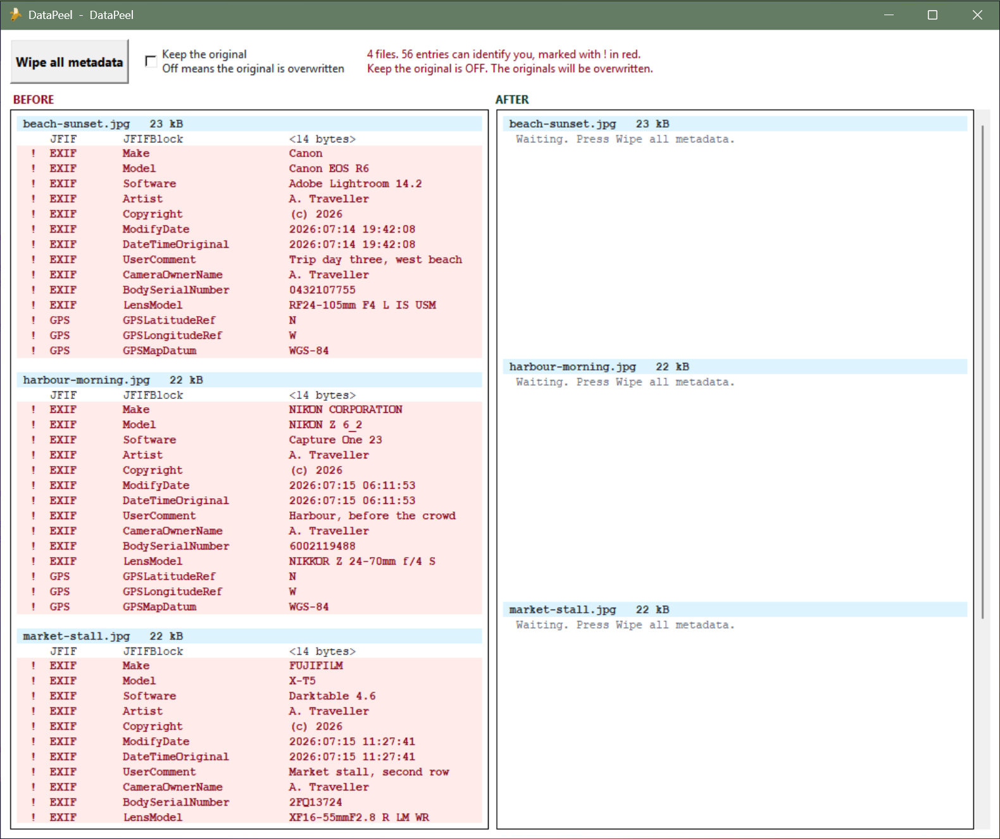
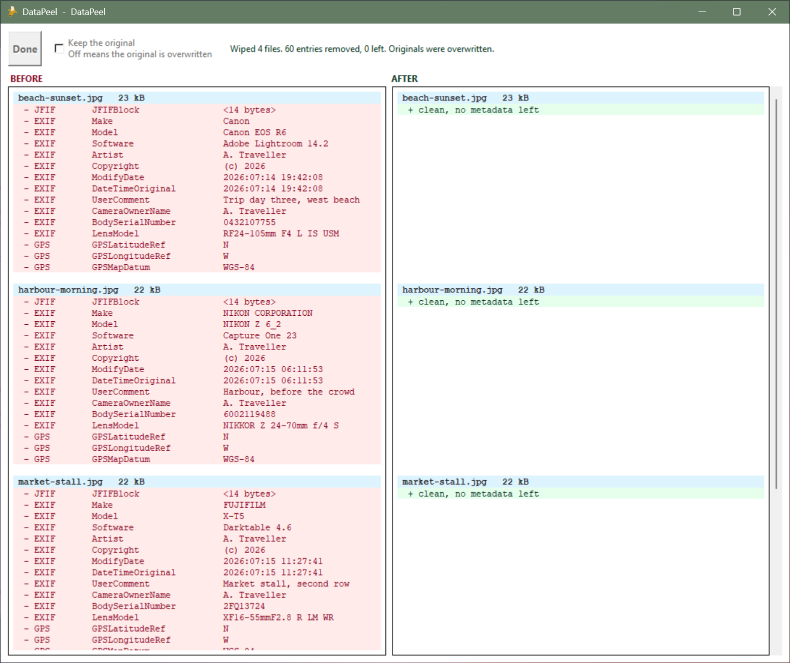

# DataPeel

DataPeel shows the metadata hidden in every picture in a folder, marks the
parts that can identify you, and wipes all of it in one click.

| Runs on | Windows, Linux, macOS |
| --- | --- |

## Download and run

| OS | Action |
| --- | --- |
| Windows | Download [DataPeel.exe](DataPeel/DataPeel.exe), put it in the folder that holds your pictures, and double-click it. It reads the folder it sits in |
| Linux | Download this repo. Install Tk with `sudo apt install python3-tk`. Then run `python3 src/metadata_wipe.py /path/to/your/pictures` |
| macOS | Download this repo, then run `python3 src/metadata_wipe.py /path/to/your/pictures` |

There is nothing to configure and no library to install. The source is
Python's standard library only. Debian and Ubuntu ship tkinter as a separate
package, which is the apt line above.

## The window

| Control | Description  |
| --- | --- |
| BEFORE | Every entry in every picture, listed on open. A red line with a `!` can identify you |
| Keep the original | On writes clean copies to a `stripped` folder. Off overwrites the originals |
| Wipe all metadata | Wipes every picture in the folder |
| AFTER | What is left once you press Wipe. Green means clean |

## Formats

| Format | Removed |
| --- | --- |
| JPEG | EXIF, XMP, ICC, IPTC, Photoshop and JFIF, whole segments at a time |
| PNG | Every text, timestamp and color profile chunk |
| GIF | Comment, plain text and application blocks. The loop block stays, or the gif plays once |
| SVG | Comments, metadata elements, and any author or license tag inside them |
| HEIC, WEBP, TIFF, RAW | Listed in the window, never touched |

The picture itself is never re-encoded, so there is no quality loss. With Keep
the original off there is no copy and a wipe cannot be undone.

## More

| File | Contents      |
| --- | --- |
| [src/metadata_wipe.py](src/metadata_wipe.py) | The whole app, one file. macOS and Linux run this file |
| [THIRD-PARTY-NOTICES.md](THIRD-PARTY-NOTICES.md) | The PyInstaller bootloader, the only other people's code in the exe |
| [LICENSE](LICENSE) | MIT |

## Requirements

| Tool | Requirements | Installed on first run |
| --- | --- | --- |
| DataPeel.exe, Windows | Nothing | Nothing |
| From source | Python 3. The script uses no other library | Nothing |
